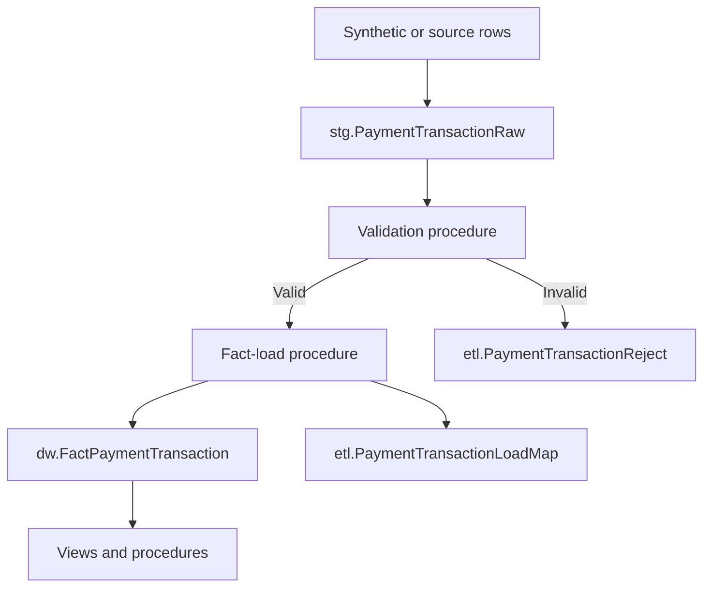

# PaymentProjectDW

PaymentProjectDW is a Microsoft SQL Server portfolio project that models a payment-processing data warehouse. It builds a star schema, generates one million synthetic payment transactions, adds reporting and analytical objects, and demonstrates an incremental staging-to-fact ETL flow with validation, rejection handling, lineage, logging, and role-based access control.

> All customers, cards, merchants, devices, and transactions in this repository are synthetic. No real payment or personal data is included.

## Highlights

- Star schema centered on `dw.FactPaymentTransaction` and nine dimensions
- 25,000 synthetic customers, approximately 40,000 cards, 5,000 merchants, and 1,000,000 fact rows
- Batch-oriented ETL with `NEW → VALID/REJECTED → LOADED` states
- ETL batch log, run log, reject table, fact-load lineage, and validation snapshots
- Reporting views and parameterized stored procedures for payment, merchant, fraud, channel, and customer-segment analysis
- Window-function examples, covering indexes, a nonclustered columnstore index, and a schema-bound indexed view
- Database roles for report readers, ETL operators, and auditors
- Rerunnable object creation guards for a clean installation workflow

## Scope decision

The project deliberately uses non-historized customer, card, and merchant dimensions. SCD Type 2 was removed to keep the repository focused on payment analytics and incremental fact loading. Business IDs remain unique and ETL lookups use those stable business codes.

## Architecture



See [docs/ARCHITECTURE.md](docs/ARCHITECTURE.md) for the data model and ETL flow.

## Requirements

- Microsoft SQL Server 2022 Developer or Express Edition recommended
- SQL Server Management Studio (SSMS) or the `sqlcmd` command-line utility
- Permission to create a database and database objects

## Quick start

Clone or download the repository, open a terminal in its root directory, and run:

```powershell
sqlcmd -S localhost\SQLEXPRESS -E -b -i run_all.sql
```

For another SQL Server instance, replace `localhost\SQLEXPRESS`. `-E` uses Windows authentication and `-b` stops on an SQL error.

In SSMS, enable **Query → SQLCMD Mode**, open `run_all.sql` from the repository root, and execute it. The `:r` directives run every setup file in dependency order. The one-million-row generator can take several minutes depending on hardware.

For the cleanest result, run the project against a new `PaymentProjectDW` database. The scripts do not attempt to migrate an older SCD Type 2 version of the schema.

## Optional tests

Tests are intentionally excluded from `run_all.sql`:

1. Run `tests/01_End_to_End_ETL_Test.sql` to insert one valid staging row, validate it, load it into the fact table, and display its lineage.
2. Run `tests/02_Indexed_View_Performance_Test.sql` with the actual execution plan enabled to compare the expanded normal view with the indexed view using `NOEXPAND`.

## Example queries

```sql
USE PaymentProjectDW;
GO

EXEC report.usp_GetPaymentSummary
    @StartDate = '2025-01-01',
    @EndDate = '2025-12-31',
    @OnlyFraud = NULL;

EXEC report.usp_GetTopMerchantPerformance
    @StartDate = '2025-01-01',
    @EndDate = '2025-12-31',
    @TopN = 20,
    @SortMetric = 'VOLUME';
```

## Repository layout

```text
sql/01_schema       Database, schemas, dimensions, and fact table
sql/02_seed         Reference data and synthetic-data generators
sql/03_reporting    Reporting views and stored procedures
sql/04_etl          ETL control, staging, validation, and fact load
sql/05_analytics    Indexes, window queries, indexed view, security, health checks
tests               Optional end-to-end and performance tests
docs                Architecture and operating notes
run_all.sql         SQLCMD-mode installation entry point
```

## Design notes

- `TransactionID` is unique in the fact table, supporting idempotent incremental loads.
- Unknown dimension members use surrogate key `0` so incomplete source records can be handled explicitly.
- `SET XACT_ABORT ON` and `TRY...CATCH` protect multi-step ETL transactions.
- ETL procedures validate prerequisites and record success, failure, skipped runs, row counts, and error details.
- Indexed-view sessions must preserve the required ANSI settings when modifying the base fact table.

Detailed execution and troubleshooting guidance is in [docs/RUNBOOK.md](docs/RUNBOOK.md).
Ready-to-use GitHub and LinkedIn copy is available in [docs/PORTFOLIO.md](docs/PORTFOLIO.md).
