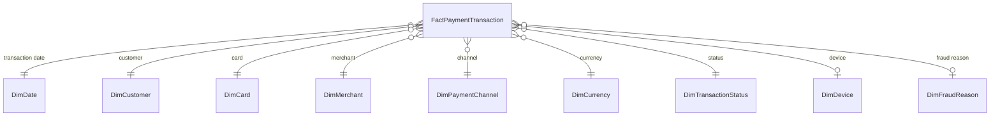

# Architecture

## Star schema

`dw.FactPaymentTransaction` stores the transaction grain: one row per payment transaction. Surrogate keys connect each payment to conformed dimensions.

The fact table contains monetary measures in original currency and TRY, fees, commission, tax, cashback, authorization duration, installment count, channel/security flags, and fraud indicators.

## ETL lifecycle

Raw rows enter `stg.PaymentTransactionRaw` with a source batch code and source row number. The validation procedure checks required fields, positive amount, transaction uniqueness.

| State | Meaning |
|---|---|

| `NEW` | Received but not validated |
| `VALID` | Passed validation and is eligible for loading |
| `REJECTED` | Failed validation or duplicate checks; reason retained |
| `LOADED` | Inserted into the fact table and linked through lineage |

`etl.ETLBatch` records batch-level status and retry information. `etl.ETLRunLog` records each procedure execution and its row/error metrics. Invalid rows are copied to `etl.PaymentTransactionReject`; successful loads are mapped through `etl.PaymentTransactionLoadMap`.

## Reporting and performance

The `report` schema exposes detailed views plus parameterized procedures. Fact-table access paths include date, channel/date, and merchant/date covering indexes. A nonclustered columnstore index supports analytical scans, while `dw.vw_MerchantDailyPaymentSummaryIndexed` materializes daily merchant through a unique clustered index.

## Security

- `rl_report_reader`: select and execute rights in the `report` schema
- `rl_etl_operator`: execute rights for ETL procedures and controlled staging access
- `rl_auditor`: read access to ETL logs, rejects, lineage, and validation snapshots

#? Users without logins are included only to demonstrate and test role membership inside the database.
